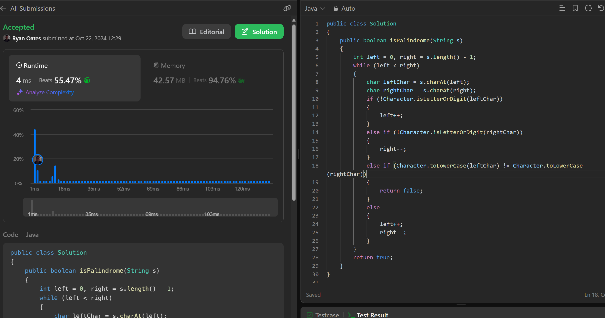
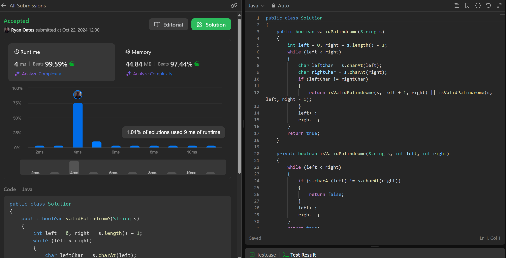

# Java Palindrome Solutions

## App.java
```java:src/App.java
public class App {
    public static void main(String[] args) throws Exception {
        // Testing SolutionTwo
        SolutionTwo solutionTwo = new SolutionTwo();
        System.out.println("Testing SolutionTwo:");
        System.out.println("Input: 'aba' -> Output: " + solutionTwo.validPalindrome("aba")); // true
        System.out.println("Input: 'abca' -> Output: " + solutionTwo.validPalindrome("abca")); // true
        System.out.println("Input: 'abc' -> Output: " + solutionTwo.validPalindrome("abc")); // false

        // Testing Solution
        Solution solution = new Solution();
        System.out.println("\nTesting Solution:");
        System.out.println("Input: 'A man, a plan, a canal: Panama' -> Output: " + solution.isPalindrome("A man, a plan, a canal: Panama")); // true
        System.out.println("Input: 'race a car' -> Output: " + solution.isPalindrome("race a car")); // false
        System.out.println("Input: ' ' -> Output: " + solution.isPalindrome(" ")); // true
    }
}
```

## SolutionTwo.java
```java:src/SolutionTwo.java
/* 680. Valid Palindrome II
Easy

Given a string s, return true if the s can be palindrome after deleting at most one character from it.

Example 1:
Input: s = "aba"
Output: true

Example 2:
Input: s = "abca"
Output: true
Explanation: You could delete the character 'c'.

Example 3:
Input: s = "abc"
Output: false

Constraints:
- 1 <= s.length <= 10^5
- s consists of lowercase English letters. */

public class SolutionTwo {
    public boolean validPalindrome(String s) {
        int left = 0, right = s.length() - 1;
        while (left < right) {
            char leftChar = s.charAt(left);
            char rightChar = s.charAt(right);
            if (leftChar != rightChar) {
                return isValidPalindrome(s, left + 1, right) || isValidPalindrome(s, left, right - 1);
            }
            left++;
            right--;
        }
        return true;
    }

    private boolean isValidPalindrome(String s, int left, int right) {
        while (left < right) {
            if (s.charAt(left) != s.charAt(right)) {
                return false;
            }
            left++;
            right--;
        }
        return true;
    }
}
```

## Solution.java
```java:src/Solution.java
/* A phrase is a palindrome if, after converting all uppercase letters into lowercase letters and removing all non-alphanumeric characters, it reads the same forward and backward. Alphanumeric characters include letters and numbers.

Given a string s, return true if it is a palindrome, or false otherwise.

Example 1:
Input: s = "A man, a plan, a canal: Panama"
Output: true
Explanation: "amanaplanacanalpanama" is a palindrome.
Example 2:
Input: s = "race a car"
Output: false
Explanation: "raceacar" is not a palindrome.
Example 3:
Input: s = " "
Output: true
Explanation: s is an empty string "" after removing non-alphanumeric characters.
Since an empty string reads the same forward and backward, it is a palindrome.

Constraints:
1 <= s.length <= 2 * 105
s consists only of printable ASCII characters. */

/**
 * This class provides a method to determine if a given string is a palindrome.
 * A phrase is considered a palindrome if, after converting all uppercase letters 
 * to lowercase and removing all non-alphanumeric characters, it reads the same 
 * forward and backward.
 */
public class Solution {
    /**
     * Checks if the input string is a palindrome.
     *
     * @param s the input string to check
     * @return true if the string is a palindrome, false otherwise
     * @throws IllegalArgumentException if the input string is null or empty
     */
    public boolean isPalindrome(String s) {
        if (s == null || s.length() == 0) {
            throw new IllegalArgumentException("Input string is null or empty");
        }
        int left = 0, right = s.length() - 1; // Two pointer approach to compare characters from both ends towards the center

        while (left < right) {
            char leftChar = s.charAt(left); // Get the character at the left pointer
            char rightChar = s.charAt(right); // Get the character at the right pointer
            if (!Character.isLetterOrDigit(leftChar)) { // If the character at the left pointer is not a letter or digit, increment the left pointer. This is to skip non-alphanumeric characters like spaces, punctuation, etc. Specfic for case 3. 
                left++; // Increment the left pointer
            } else if (!Character.isLetterOrDigit(rightChar)) { // If the character at the right pointer is not a letter or digit, decrement the right pointer. This is to skip non-alphanumeric characters like spaces, punctuation, etc. Specfic for case 3. 
                right--; // Decrement the right pointer
            } else if (Character.toLowerCase(leftChar) != Character.toLowerCase(rightChar)) { // If the characters at the left and right pointers are not the same after converting to lowercase, return false. This is to check if the characters are the same ignoring case. 
                return false;
            } else {
                left++; // Increment the left pointer
                right--; // Decrement the right pointer
            }
        }
        return true; // If all characters match, return true. 
    }
}
```
